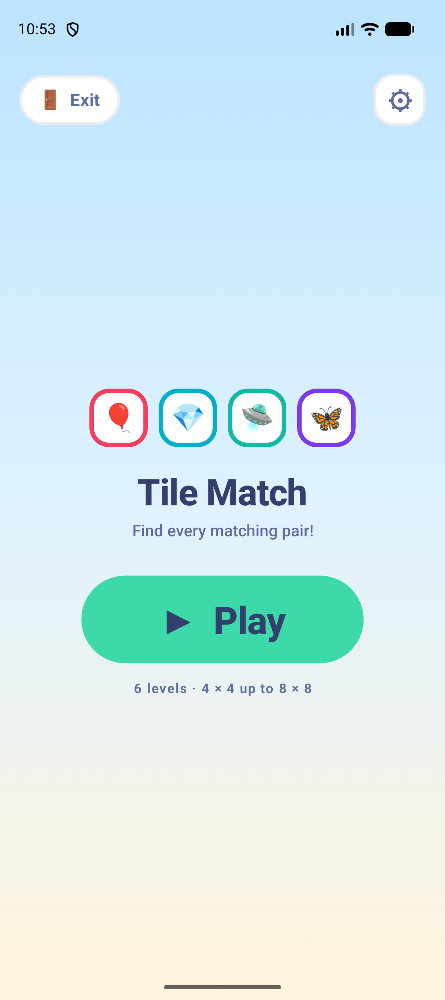
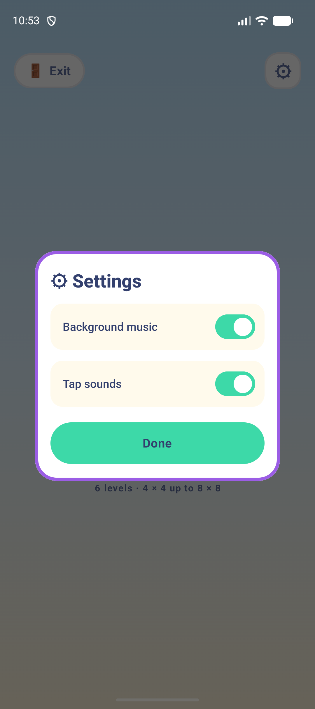
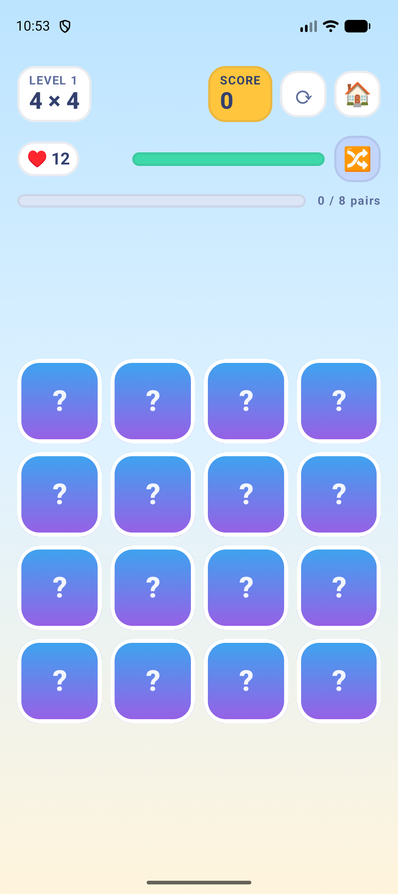
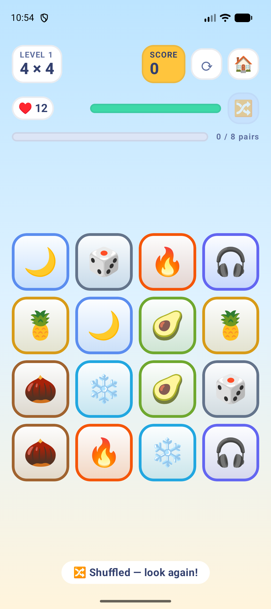
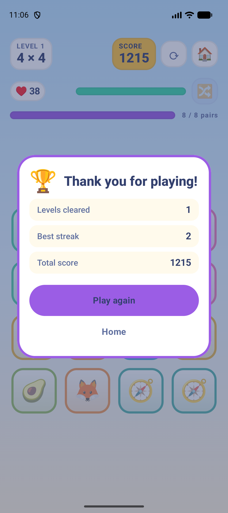

# Tile Match

A child-friendly memory match game for Android, built with Kotlin and Jetpack Compose.

Boards start at 4 × 4 and grow every level up to 8 × 8. Every tile is a big, colourful
sticker; every correct pair hands hearts back, so a good memory keeps the run alive instead
of ending it. Six levels, then the game says thank you.

> Built end to end with **Claude AI** ([Claude Code](https://claude.com/claude-code)) —
> designed, specified and directed by me, implemented in collaboration with the agent.
> See [Built with Claude](#built-with-claude) for how the work was actually driven.

| Menu | Settings | Playing | Shuffle look | Win |
| --- | --- | --- | --- | --- |
|  |  |  |  |  |

## How it plays

1. A splash screen pops four sticker tiles in, then hands off to the menu. Tap to skip it.
2. **Play** deals the board face up for a short memorise window, then flips everything down.
3. Tap two tiles. A match stays up, pays hearts back, and builds a streak. A miss flips both
   back and costs one heart.
4. Clearing every pair finishes the level. Running out of hearts ends the run.
5. **🔀 Shuffle** rearranges the tiles still in play and shows them for a ten-second look
   before they go face down again. It is free and unlimited — it costs no hearts and has no
   cooldown, so a stuck player is never stuck for long.
6. **🏠** quits to the home screen at any time. The system back button does the same.
7. Clearing the last level shows a **Thank you for playing!** card with confetti.

## Progression

Boards grow one dimension at a time until they hit the 8 × 8 cap. Odd tile counts gain a
column so every board can always be split into pairs.

| Level | Board | Pairs | Opening hearts | Hearts per match |
| --- | --- | --- | --- | --- |
| 1 | 4 × 4 | 8 | 12 | 5 |
| 2 | 5 × 6 | 15 | 23 | 5 |
| 3 | 6 × 6 | 18 | 28 | 4 |
| 4 | 7 × 8 | 28 | 39 | 4 |
| 5 | 8 × 8 | 32 | 44 | 3 |
| 6 | 8 × 8 | 32 | 44 | 3 |

- Opening hearts are `3 × columns`, plus 5 for every level the board has grown.
- The per-match reward starts at 5 and drops by 1 every two levels, with a floor of 1, so
  later levels are less forgiving without ever becoming unwinnable.
- Level 6 is the finale on purpose: it is one level past the point where the board stops
  growing, so the run ends on a full-size board at a tightened reward rate rather than on
  the first board that merely stopped growing. `LevelPlan.LAST_LEVEL` is the single knob.
- Difficulty never loosens once the board is capped — the unit tests assert it.

## Scoring

- **100** per matched pair.
- **+25 × streak** for each consecutive match, reset by a miss.
- **Clear bonus** of up to **500**, scaled by the share of the level's total possible hearts
  still in hand, plus **25 × level**. It measures accuracy, so it does not inflate as the
  reward rate changes.

## Sound

Two independent switches behind the ⚙ in the menu, persisted across launches:

- **Background music** — a looping 19.2 s music-box phrase.
- **Tap sounds** — the interface and gameplay effects (tap, button, shuffle, match, miss,
  level clear, game over, win fanfare).

Every sound in `app/src/main/res/raw` is generated, not licensed: `tools/make_audio.py`
synthesizes all nine WAVs from scratch with Python's standard library (`wave`, `math`,
`struct`) using additive sine partials, exponential decay envelopes and phase-accumulated
sweeps, with edge fades so the music loop does not click. Regenerate them with:

```bash
python tools/make_audio.py
```

## Architecture

MVVM with a deliberately Android-free core, so the game rules are unit-testable.

```
model/      LevelPlan (the curve), GameUiState + Phase, Tile, GameEvent
game/       GameViewModel (all rules), BoardFactory, Symbols
ui/         MatchTilesApp (navigation), SplashScreen, MenuScreen, GameScreen,
            Board, TileCard, Hud, Overlays, Confetti, theme/
audio/      GameAudio (SoundPool + MediaPlayer) behind an AudioController interface
data/       SettingsStore (SharedPreferences mirrored into StateFlows)
```

Notable decisions:

- **The ViewModel never touches a `Context`.** It reports what happened through a
  `MutableSharedFlow<GameEvent>`; the UI turns those events into sound via a `LocalAudio`
  composition local. `SilentAudio` is the default, which keeps previews and tests quiet.
- **No extra dependencies.** Navigation is an `enum class Screen` plus `remember` and a
  `BackHandler`; the splash is hand-rolled rather than `core-splashscreen`. The project
  builds `--offline` against exactly the libraries in `gradle/libs.versions.toml`.
- **Timing is driven by the animation, not by a clock.** Every deal and shuffle bumps a
  `dealId`, the tiles are keyed on it, and the entrance animation's own completion callback
  arms the look window. A board is therefore never memorised before it is actually on
  screen, however slow a cold start is.
- Compose targets `minSdk 26` / `compileSdk 37`, Java and Kotlin both on JVM 17.

## Build and run

Needs the Android SDK and a JDK 17+ (Android Studio's bundled JBR works).

```bash
./gradlew :app:assembleDebug      # build
./gradlew :app:installDebug       # install on a connected device or emulator
./gradlew :app:testDebugUnitTest  # 32 JUnit tests
```

Or open the project in Android Studio and press Run.

## Tests

32 JUnit 4 tests, all green, covering the level curve, the board dealer and the whole
ViewModel state machine — including that a shuffle preserves progress and the exact symbol
multiset, that the ten-second look only starts once the board is drawn, that spending every
heart ends the run, and that clearing the last level wins the game for good. Coroutine
timing is driven with `kotlinx-coroutines-test`, so the suite runs in seconds with no
real delays.

```bash
./gradlew :app:testDebugUnitTest
```

## Built with Claude

This project was built with **Claude AI**, using [Claude Code](https://claude.com/claude-code)
as an agentic coding tool in the terminal. It is here as a portfolio piece for exactly that:
not a copy-pasted snippet, but a full Android app taken from an idea to a tested, verified
build through directed AI collaboration.

**What I brought to it.** The concept and every design decision: a 4 × 4 opening board that
grows each level, hearts equal to three times the column count, +5 hearts per correct match
so a strong memory extends the run, a per-level budget that grows with the board, a
child-friendly cartoon look, and the feature set — splash, menu, two-switch sound settings,
a shuffle that reopens the board for a ten-second look, quit-to-home, and a thank-you card
for finishing the campaign. When the first reward model let a good player go on forever, I
called for it and asked for the curve to be reworked.

**Where I pushed back on the AI.** Directing an agent well means auditing it, not accepting
it. Real examples from this build:

- The original difficulty curve *loosened* after the board hit its 8 × 8 cap, because the
  heart budget kept growing while the grid stood still. That became a plateau rule with a
  test (`difficulty never loosens once the board is capped`) that fails if it regresses.
- The memorise window was originally timed with a fixed delay, so on a slow cold start the
  board was "memorised" before it had finished drawing. It now starts from the tile entrance
  animation's own completion callback — a correctness fix, not a longer sleep.
- That same fix exposed a real bug: retrying a level hung on the memorise screen, because
  tiles were keyed on the level number and a redeal at the same level never re-animated.
  Keying on a per-deal `dealId` fixed retry and made the shuffle's ten-second look work.

**How it was verified.** Nothing here is "it compiles, ship it". The rules live in a
`Context`-free ViewModel so they are unit-testable, and **32 JUnit tests** pin the level
curve, the board dealer and the full state machine, with coroutine time driven by
`kotlinx-coroutines-test`. On top of that, every screen was walked on a real emulator with
adb automation — dumping the accessibility tree to find and tap elements, then capturing
screenshots — which is how the shuffle look, the quit button and the win card were confirmed
visually rather than assumed. The screenshots above came from those runs.

**Constraints worked within.** The build runs `--offline` with no new dependencies, so
navigation and the splash screen are hand-rolled instead of pulled from a library, and all
nine sound effects and the music loop are synthesized from scratch in `tools/make_audio.py`
with Python's standard library — no licensed audio assets.


## License

[MIT](LICENSE) — free to read, run, fork and learn from.
